# I-V Tree


I-V Tree is a full-stack Django web application designed to help communities report, monitor and share information about trees affected by invasive ivy.

Users can create accounts, record affected trees and their locations, upload photographs, add progress updates, explore public reports on an interactive map, contribute to the community area and support the project through Stripe-powered donations.

The central idea behind I-V Tree is that **the tree becomes the record**. A report is not intended to be a one-off complaint: it can develop into a persistent history showing the location, condition, intervention status and progress of an individual tree over time.

## Live Site

[I-V Tree — https://ivtree.co.uk/](https://ivtree.co.uk/)

## GitHub Repository

[https://github.com/starearthrocket/iv-tree-v3](https://github.com/starearthrocket/iv-tree-v3)

---

## Table of Contents

- [Project Purpose](#project-purpose)
- [Target Users](#target-users)
- [User Stories](#user-stories)
- [User Experience](#user-experience)
- [Design](#design)
- [Features](#features)
- [Authentication and Permissions](#authentication-and-permissions)
- [Data Model](#data-model)
- [Application Structure](#application-structure)
- [Technologies Used](#technologies-used)
- [Third-Party Services](#third-party-services)
- [Testing](#testing)
- [Automated Testing](#automated-testing)
- [Manual Testing](#manual-testing)
- [Accessibility](#accessibility)
- [Validation](#validation)
- [Bugs and Fixes](#bugs-and-fixes)
- [Security](#security)
- [Deployment](#deployment)
- [Local Development](#local-development)
- [Environment Variables](#environment-variables)
- [Known Limitations](#known-limitations)
- [Future Development](#future-development)
- [Version Control](#version-control)
- [Credits](#credits)

---

# Project Purpose

I-V Tree was created as a real-world conservation-focused application.

Its purpose is to allow people to create and maintain useful records of trees affected by invasive ivy, rather than simply submitting a one-time report.

A tree record may include:

- photographs;
- structured location data;
- status;
- visibility;
- progress updates;
- what3words location information;
- a timeline of changes.

A report can move through several statuses:

- Active;
- In Progress;
- Protected;
- Resolved;
- Needs Attention.

This allows the application to represent a tree's changing condition rather than replacing historical information.

The application also includes:

- user accounts;
- profiles;
- public and private reports;
- a public interactive map;
- community posts;
- Stripe donations;
- production password-reset email.

---

# Target Users

I-V Tree is intended for:

- members of the public interested in local trees;
- community conservation volunteers;
- tree wardens;
- users monitoring individual trees;
- people wishing to document changes over time;
- community members sharing information about tree protection.

The interface is designed to remain understandable to users who may not have specialist technical or arboricultural knowledge.

---

# User Stories

## Public Visitor

As a visitor, I want to:

- understand the purpose of I-V Tree immediately;
- explore public tree reports without registering;
- view the public map;
- read public community posts;
- view public member profiles;
- understand how I can contribute;
- create an account if I decide to participate.

## Registered User

As a registered user, I want to:

- create a tree report;
- add a photograph;
- record its location;
- choose whether it is public or private;
- update my report;
- delete my report if necessary;
- add progress updates over time;
- manage my profile;
- create community posts;
- view my reports and posts from my dashboard.

## Tree Report Owner

As the owner of a tree report, I want to:

- edit my own report;
- add progress information;
- change its status;
- view its location on a map;
- prevent other ordinary users from modifying it.

## Community User

As a community user, I want to:

- read published posts;
- create my own post;
- edit my own post;
- delete my own post;
- visit another member's public profile.

## Supporter

As a supporter, I want to:

- enter a donation amount;
- be taken securely to Stripe Checkout;
- receive clear feedback if the payment succeeds, fails or is cancelled.

---

# User Experience

## UX Goals

The main UX goals were to:

1. make the purpose of the application immediately clear;
2. create simple navigation between reporting, mapping, community and account functions;
3. minimise friction when creating a report;
4. give clear feedback after user actions;
5. protect private records;
6. provide a usable mobile experience;
7. maintain visual consistency across the application;
8. allow useful public browsing without requiring an account;
9. provide keyboard-accessible interaction;
10. make destructive actions require confirmation.

## Main User Journey

A typical user can:

1. arrive on the homepage;
2. understand the Report → Protect → Monitor concept;
3. explore public reports;
4. register;
5. create a tree report;
6. enter structured location information;
7. add a photograph;
8. return to the report later;
9. add progress updates;
10. monitor the tree's history.

## Public and Authenticated Experiences

Public visitors can:

- view the homepage;
- explore public tree reports;
- use the public map;
- read published community posts;
- view public profiles;
- visit the Support page;
- register or log in.

Authenticated users can additionally:

- create reports;
- edit their own reports;
- delete their own reports;
- create progress updates;
- edit/delete authorised progress updates;
- create community posts;
- edit/delete their own posts;
- manage their profile;
- access their dashboard.

---

# Design

I-V Tree uses a green and cream visual identity inspired by woodland and conservation.

The design uses:

- forest imagery;
- deep green navigation and buttons;
- pale green and cream backgrounds;
- rounded cards;
- custom tree-status map markers;
- consistent typography;
- clear spacing;
- responsive layouts.

The visual design aims to feel community-focused and approachable rather than administrative.

## Mockups

Mockups were created for the major user-facing views.

### Homepage

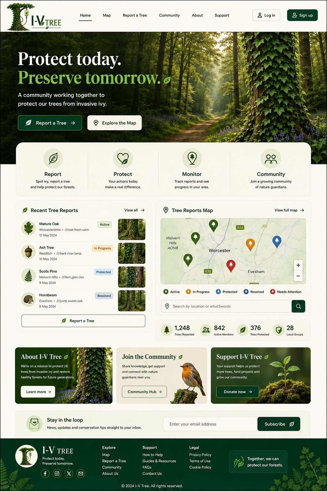

### Explore Map

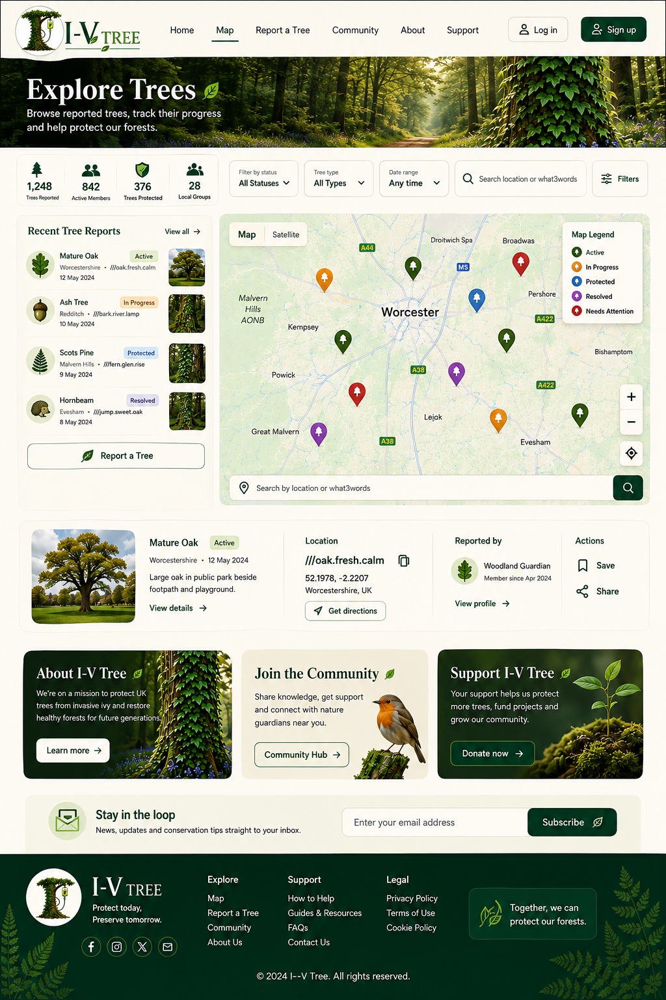

### Report a Tree

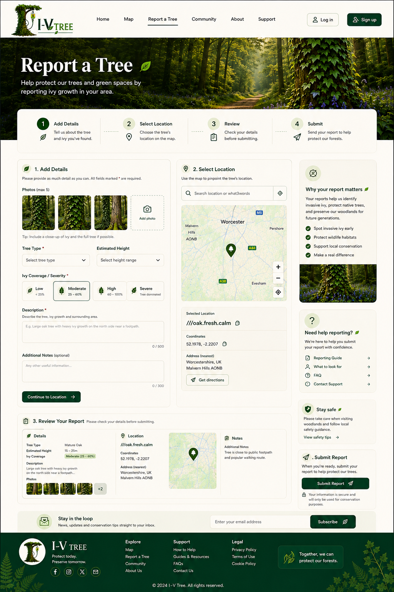

### Dashboard

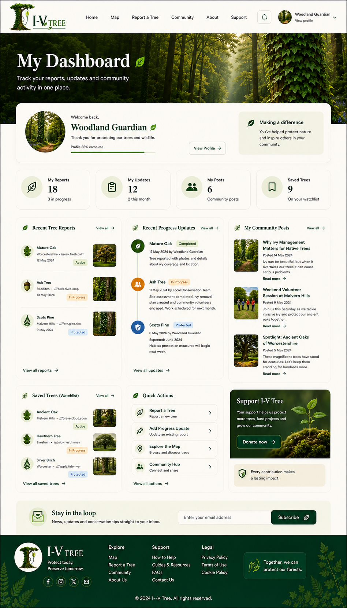

### Profile

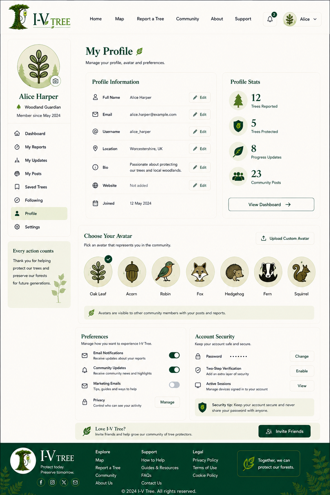

### Community

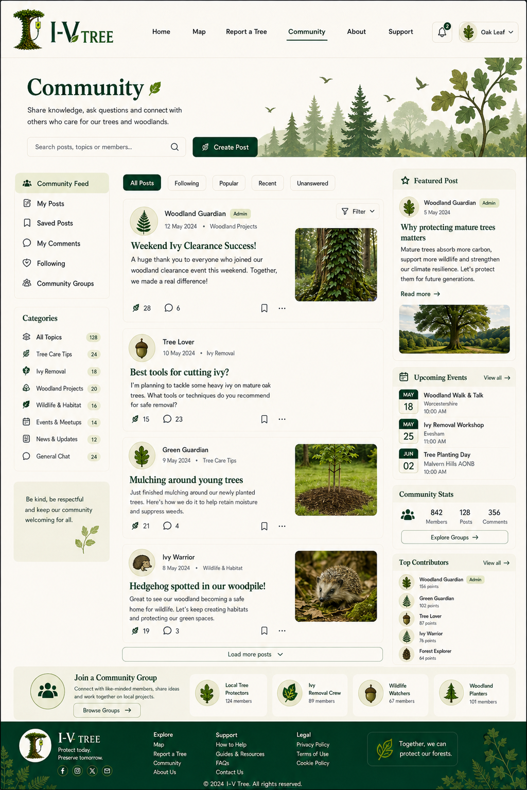

### Support

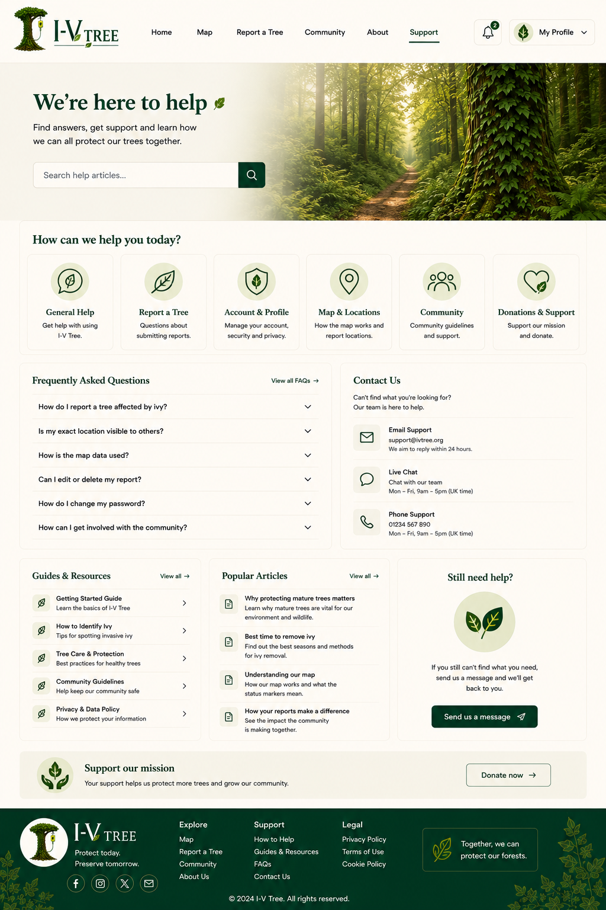

### Login

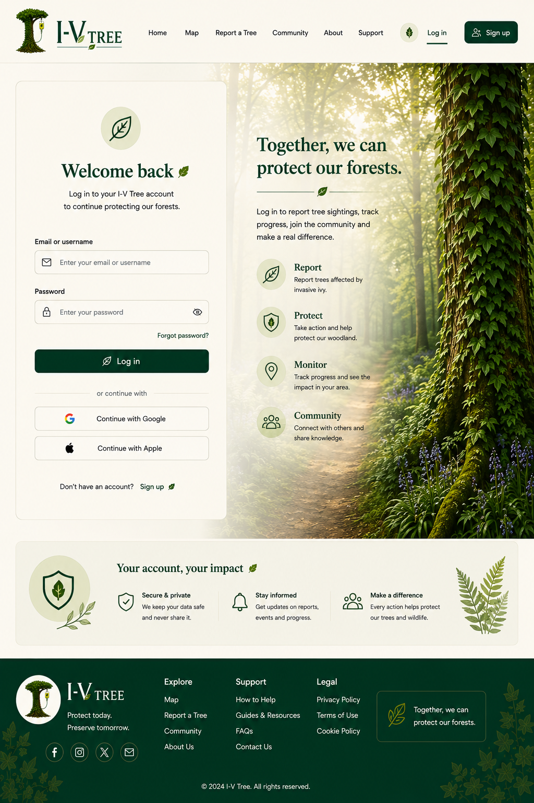

### Registration

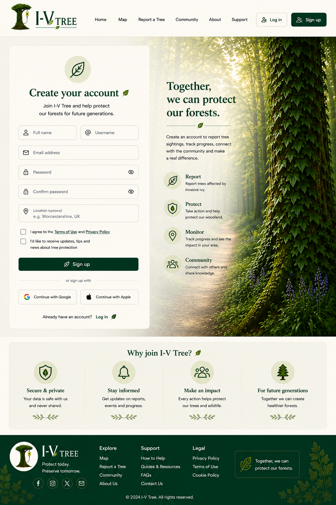

### Tree Detail

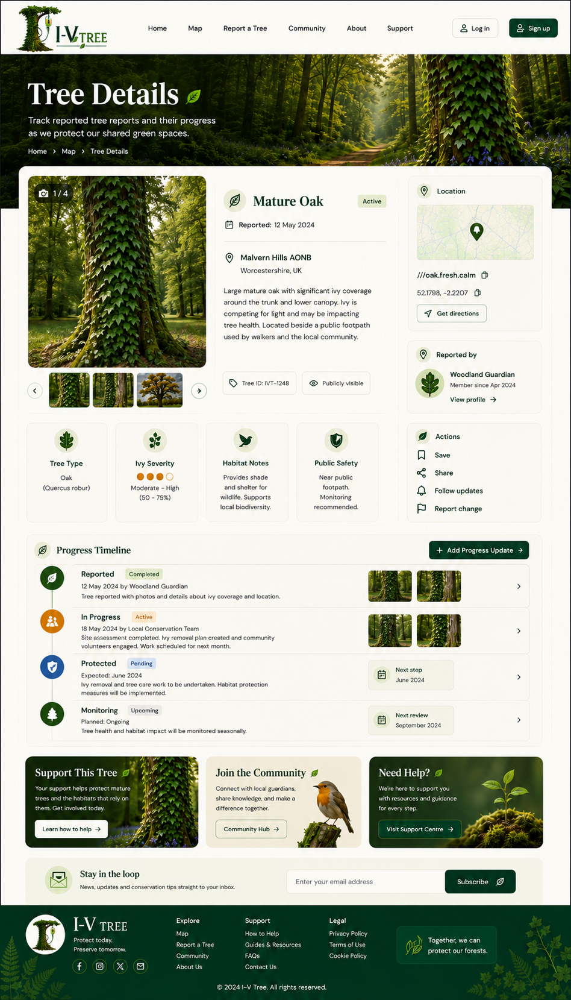

### Error States

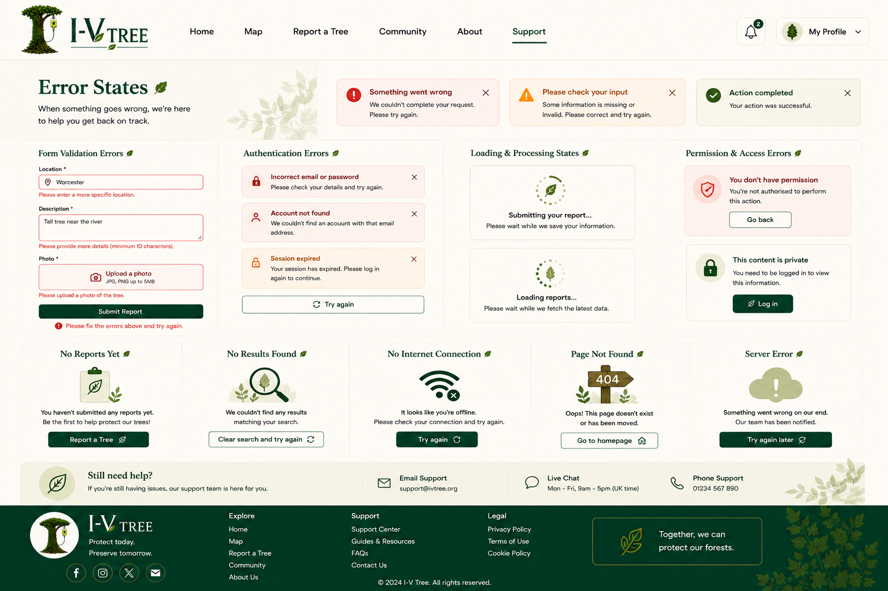

---

# Features

## Homepage

The homepage contains:

- project introduction;
- Report → Protect → Monitor explanation;
- links to report a tree and explore the map;
- real recent public reports;
- a live Google Maps preview;
- links to individual reports;
- community information;
- responsive desktop/mobile layouts.

During final development, the original static prototype map was replaced with live report data and an interactive map.

---

## Tree Reporting

Authenticated users can create a tree report containing:

- title;
- tree species;
- description;
- photograph;
- country;
- region;
- town/city;
- latitude;
- longitude;
- what3words reference;
- status;
- visibility.

Latitude and longitude values are validated at model level.

Latitude is restricted to:

```text
-90 to 90
```

Longitude is restricted to:

```text
-180 to 180
```

---

## Report Visibility

Reports can be:

- Public
- Private

Public reports may appear in public-facing report views and the Explore Map.

Private reports are restricted to the report owner.

Private records are therefore not intentionally exposed through:

- the public map;
- public report lists;
- public member profiles.

---

## Tree Status

Tree reports support:

- Active
- In Progress
- Protected
- Resolved
- Needs Attention

Custom map markers are used to visually distinguish these states.

---

## Progress Updates

Each tree report can contain multiple progress updates.

A progress update can contain:

- description;
- optional photograph;
- optional status;
- author;
- creation timestamp;
- update timestamp.

This allows the application to preserve an historical record rather than overwriting previous observations.

---

## Explore Map

The Explore Map displays public reports using Google Maps.

Features include:

- Google Maps JavaScript API;
- custom I-V Tree status markers;
- marker clustering;
- public report cards;
- keyword search;
- status filtering;
- Clear Filters action;
- Show on Map links;
- report-detail links;
- mobile layout.

Private reports are excluded from the public map.

---

## Location Tools

Structured location information includes:

- country;
- region;
- town/city;
- latitude;
- longitude;
- what3words.

Google Maps is used for map presentation and location interaction.

what3words provides an additional location reference.

---

## Dashboard

Authenticated users have a dashboard showing their own activity.

The dashboard includes:

- tree reports;
- community posts;
- links to full records.

This gives users a central route back to records they have created.

---

## Profiles

Each Django user can have one I-V Tree profile.

Profiles support:

- avatar selection;
- biography;
- public profile view.

Nature-themed avatar choices include:

- Oak Leaf;
- Acorn;
- Robin;
- Fox;
- Hedgehog;
- Fern;
- Badger;
- Squirrel;
- Deer;
- Pinecone.

---

## Community

The Community app allows authenticated users to create posts.

Posts contain:

- author;
- title;
- content;
- optional image;
- published/unpublished state;
- created date;
- updated date.

Published posts are publicly readable.

Edit/delete actions are restricted to the author.

---

## Donations and Stripe

The Support application integrates Stripe Checkout.

The donation flow includes:

- minimum-amount validation;
- Stripe Checkout session creation;
- payment-status tracking;
- webhook processing;
- success feedback;
- cancelled-payment feedback;
- failed-payment handling.

The minimum donation is:

```text
£1.00
```

Donation payment states are:

- Pending;
- Paid;
- Cancelled;
- Failed.

Stripe webhook verification is used for server-side payment processing.

---

## Password Reset

The application includes a production password-reset workflow.

Users can:

1. request a reset;
2. receive a reset email;
3. follow the secure link;
4. choose a new password;
5. log in with the updated password.

The complete flow was tested on the live deployed site.

Transactional email is sent from:

```text
noreply@ivtree.co.uk
```

---

## Error Pages

Custom error handling includes:

- 404 Page Not Found;
- 500 Server Error.

The custom 404 page gives users a clear route back into the application.

---

# Authentication and Permissions

I-V Tree uses Django's authentication system.

## Authentication Features

Users can:

- register;
- log in;
- log out;
- reset forgotten passwords.

Authenticated users are redirected away from anonymous-only login and registration pages.

## Permissions

Permission checks protect user-owned data.

Examples include:

- report creation requires login;
- report editing is limited to its owner;
- report deletion is limited to its owner;
- private reports are limited to their owner;
- progress-update permissions are checked;
- community edit/delete actions are author-restricted;
- dashboard/profile editing requires authentication;
- Django admin remains restricted to staff/admin users.

Permission behaviour was manually tested using a report belonging to a different normal user.

The logged-in test user could not edit the other user's report.

---

# Data Model

I-V Tree uses Django's relational ORM.

Production uses PostgreSQL.

Local development can use SQLite.

## Entity Relationships

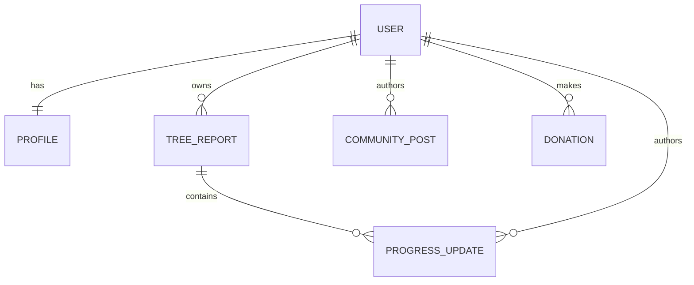
```mermaid
erDiagram
    USER ||--|| PROFILE : has
    USER ||--o{ TREE_REPORT : owns
    TREE_REPORT ||--o{ PROGRESS_UPDATE : contains
    USER ||--o{ PROGRESS_UPDATE : authors
    USER ||--o{ COMMUNITY_POST : authors
    USER ||--o{ DONATION : makes
```

---

## Profile

`Profile` extends the Django user with additional I-V Tree information.

| Field | Purpose |
|---|---|
| user | One-to-one relationship with Django user |
| avatar_choice | Selected nature-themed avatar |
| bio | Optional biography |
| created_at | Creation timestamp |
| updated_at | Last update timestamp |

Relationship:

```text
User 1 → 1 Profile
```

---

## TreeReport

`TreeReport` represents one reported tree.

| Field | Purpose |
|---|---|
| owner | User who created the report |
| title | Report title |
| tree_species | Optional tree species |
| description | Report description |
| photo | Optional photograph |
| location_name | Legacy compatibility field |
| country | Structured country |
| region | County/state/province/region |
| town_city | Town/city |
| latitude | Geographic latitude |
| longitude | Geographic longitude |
| what3words | Optional what3words reference |
| status | Current tree state |
| visibility | Public/private |
| created_at | Creation timestamp |
| updated_at | Update timestamp |

Relationship:

```text
User 1 → many TreeReports
```

### Legacy Location Field

`location_name` is intentionally retained as a backwards-compatibility field for older records created before structured location fields were introduced.

Newer report data uses:

- country;
- region;
- town/city;
- latitude/longitude;
- what3words.

The legacy value remains available as a fallback so earlier records are not broken during the transition.

---

## ProgressUpdate

`ProgressUpdate` stores chronological updates connected to an existing report.

| Field | Purpose |
|---|---|
| tree_report | Parent TreeReport |
| author | Update author |
| description | Progress details |
| photo | Optional photograph |
| status | Optional status |
| created_at | Creation timestamp |
| updated_at | Update timestamp |

Relationships:

```text
TreeReport 1 → many ProgressUpdates
User 1 → many ProgressUpdates
```

Progress updates use `CASCADE` for the parent report relationship, so deleting the tree report removes its associated progress history.

---

## CommunityPost

`CommunityPost` represents a community contribution.

| Field | Purpose |
|---|---|
| author | Post author |
| title | Post title |
| content | Post content |
| image | Optional image |
| is_published | Publication state |
| created_at | Creation timestamp |
| updated_at | Update timestamp |

Relationship:

```text
User 1 → many CommunityPosts
```

---

## Donation

`Donation` stores a Stripe donation transaction record.

| Field | Purpose |
|---|---|
| user | Optional authenticated user |
| amount | Donation amount |
| stripe_session_id | Unique Stripe Checkout session |
| payment_status | Current payment state |
| created_at | Creation timestamp |

Relationship:

```text
User 1 → many Donations
```

The user relationship is nullable so a donation record does not depend on the continued existence of an account.

---

# Application Structure

The project is separated into reusable Django apps.

```text
iv-tree-v3/
│
├── accounts/
├── community/
├── config/
├── core/
├── reports/
├── support/
├── templates/
├── static/
├── assets/
├── docs/
├── manage.py
├── Procfile
├── requirements.txt
└── README.md
```

## `accounts`

Responsible for:

- registration;
- authentication-related views;
- profiles;
- dashboard;
- public profiles;
- password reset.

## `reports`

Responsible for:

- TreeReport;
- ProgressUpdate;
- report CRUD;
- progress CRUD;
- report permissions;
- map data;
- location integration.

## `community`

Responsible for:

- community posts;
- post CRUD;
- publication behaviour;
- ownership restrictions.

## `support`

Responsible for:

- donation form;
- Stripe Checkout;
- Stripe webhook processing;
- donation state.

## `core`

Responsible for:

- homepage;
- project-level views;
- custom 404/500 handlers.

---

# Technologies Used

## Main Technologies

- Python
- Django
- HTML5
- CSS3
- JavaScript
- PostgreSQL
- SQLite
- Git
- GitHub

## Python Dependencies

| Package | Purpose |
|---|---|
| Django 6.1.1 | Full-stack web framework |
| gunicorn 26.2.0 | Production WSGI server |
| psycopg | PostgreSQL driver |
| dj-database-url | Environment-driven database configuration |
| Pillow | Image processing support |
| django-countries | Structured country field |
| stripe | Stripe API integration |
| cloudinary | Cloud media service |
| django-cloudinary-storage | Django media integration |
| whitenoise | Static-file handling |
| python-dotenv | Local environment variables |
| requests | HTTP client |

Exact versions are recorded in:

```text
requirements.txt
```

---

# Third-Party Services

## Heroku

Heroku hosts the production Django application.

The application currently uses manual deployment from the connected GitHub repository.

## Heroku Postgres

The live application uses PostgreSQL through Heroku Postgres.

Database configuration is read using `dj-database-url`.

## Google Maps Platform

Google Maps supports:

- Explore Map;
- homepage mini-map;
- tree-detail map;
- location interaction.

The production HTTP referrer restrictions include:

```text
https://ivtree.co.uk/*
https://www.ivtree.co.uk/*
```

## what3words

what3words supplies an additional precise-location reference.

Its API credential is stored outside Git.

## Stripe

Stripe Checkout processes support donations.

Stripe configuration includes:

- public key;
- secret key;
- webhook signing secret;
- currency.

## Cloudinary

Cloudinary is configured for production media handling.

Uploaded media can include:

- report photographs;
- progress photographs;
- community post images.

## Purelymail

Purelymail supplies SMTP delivery for production transactional email.

The deployed password-reset flow uses:

```text
noreply@ivtree.co.uk
```

## Porkbun

The custom production domain:

```text
ivtree.co.uk
```

is managed through Porkbun DNS.

---

# Testing

Testing included:

- automated Django tests;
- Django system checks;
- manual functionality tests;
- permission testing;
- responsive testing;
- keyboard testing;
- browser zoom testing;
- browser-console checks;
- HTML validation;
- CSS validation;
- JavaScript validation;
- production regression testing.

---

# Automated Testing

The full Django test suite is run with:

```bash
python manage.py test
```

Final result:

```text
Found 58 test(s).
System check identified no issues (0 silenced).

Ran 58 tests

OK
```

The Stripe-related console messages produced during the suite are expected test cases covering:

- invalid webhook signatures;
- unknown Checkout sessions;
- simulated Stripe errors.

They test failure-handling behaviour and do not represent failing tests.

## Areas Covered

Automated tests include:

- authentication;
- registration/login behaviour;
- authenticated-user redirects;
- dashboard;
- public profile;
- password reset;
- report functionality;
- report map;
- progress-update CRUD;
- report permissions;
- community post views;
- Stripe support;
- Stripe webhook behaviour.

Additional checks used during development include:

```bash
python manage.py check
```

and:

```bash
git diff --check
```

---

# Manual Testing

## Responsive Testing

Responsive behaviour was tested on desktop and narrow mobile widths.

| Area | Result |
|---|---|
| Homepage | PASS |
| Report form | PASS |
| Explore Map | PASS |
| Dashboard | PASS |
| Profile | PASS |
| Edit Profile | PASS |
| Community | PASS |
| Support | PASS |
| Login | PASS |
| Register | PASS |
| Password Reset | PASS |
| Custom 404 | PASS |
| Mobile navigation | PASS |

## Functional Tests

| Test | Result |
|---|---|
| Register account | PASS |
| Login/logout | PASS |
| Password reset request | PASS |
| Production reset email arrives | PASS |
| Reset link changes password | PASS |
| Login with new password | PASS |
| Create report | PASS |
| Edit own report | PASS |
| Delete own report | PASS |
| Prevent editing another user's report | PASS |
| Private report hidden publicly | PASS |
| Public report visible publicly | PASS |
| Create progress update | PASS |
| Report map loads | PASS |
| Map markers load | PASS |
| Search reports | PASS |
| Filter by status | PASS |
| Show on Map | PASS |
| Tree detail map | PASS |
| Homepage map | PASS |
| Create community post | PASS |
| View community post | PASS |
| Edit/delete own post | PASS |
| Delete confirmation | PASS |
| Donation validation | PASS |
| Stripe Checkout opens | PASS |
| Stripe cancel/back flow | PASS |
| Browser back/forward navigation | PASS |
| Custom 404 | PASS |

---

# Accessibility

Accessibility was included in final manual testing.

## Keyboard Navigation

Result: **PASS**

Keyboard-only navigation was tested across the homepage and interactive controls.

Checks included:

- visible focus;
- tabbable navigation;
- tabbable buttons;
- activation using Enter;
- no inaccessible hidden focus states.

## Skip Link

Result: **PASS**

The Skip to Main Content link appears on keyboard focus and allows users to bypass repeated navigation.

## Required Field Focus

Result: **PASS**

Submitting an incomplete report form moves focus to the first required field that needs attention.

## 200% Browser Zoom

Result: **PASS**

The homepage remained usable at 200% browser zoom.

Checked:

- readable text;
- usable navigation;
- non-overlapping controls;
- scrollable content;
- no important content loss.

## Mobile Navigation

Result: **PASS**

The hamburger navigation was tested for:

- open/close behaviour;
- visible links;
- working links;
- no off-screen overflow.

---

# Validation

## HTML

HTML was checked using the W3C Nu HTML Checker.

### Homepage

Result: **PASS**

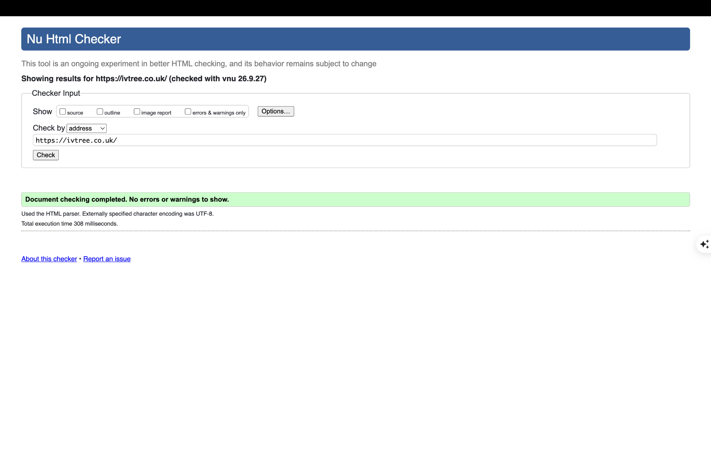

### Explore Map

Result: **PASS**


### Report a Tree

Result: **PASS**

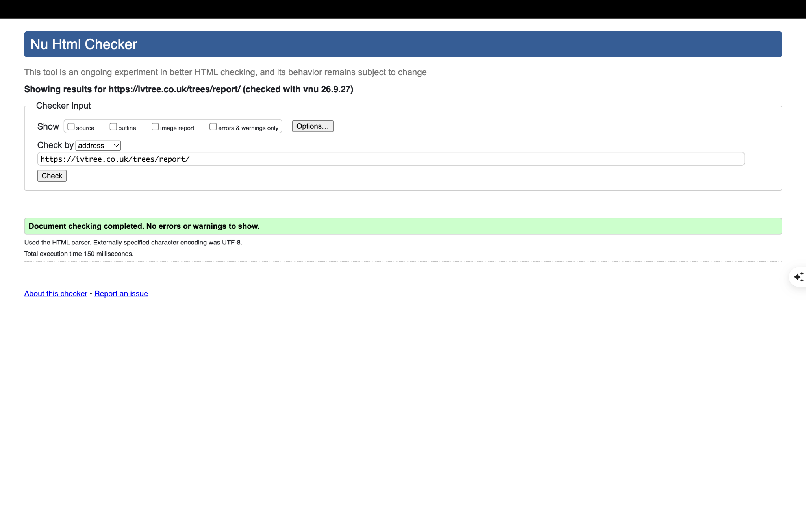

### Community

Result: **PASS**


### Community Post Create

Result: **PASS**


### Community Post Detail

Result: **PASS**

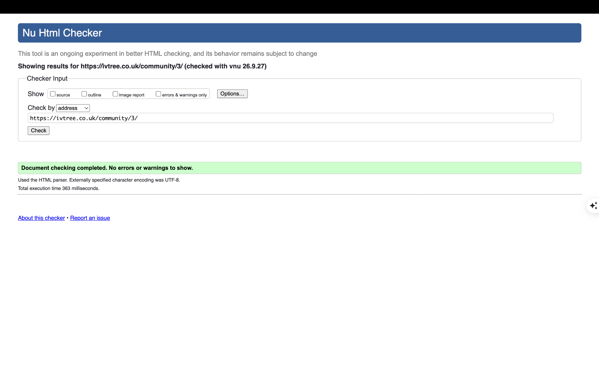

### Dashboard

Result: **PASS**

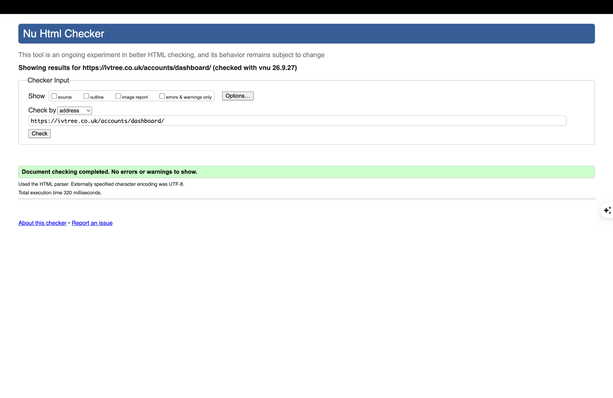

### Profile

Result: **PASS**


### Public Profile

Result: **PASS**


### Login

Result: **PASS**

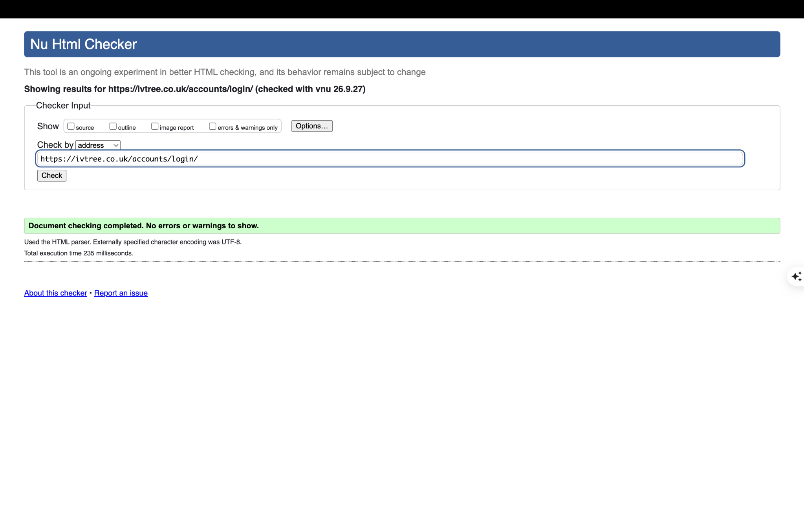

### Registration

Result: **PASS**


### Password Reset

Result: **PASS**

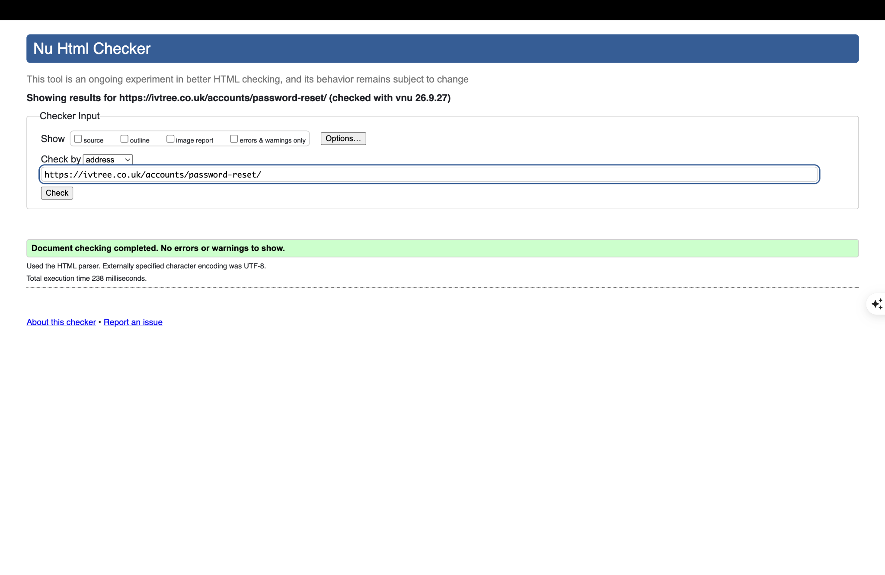

### Password Reset Done

Result: **PASS**

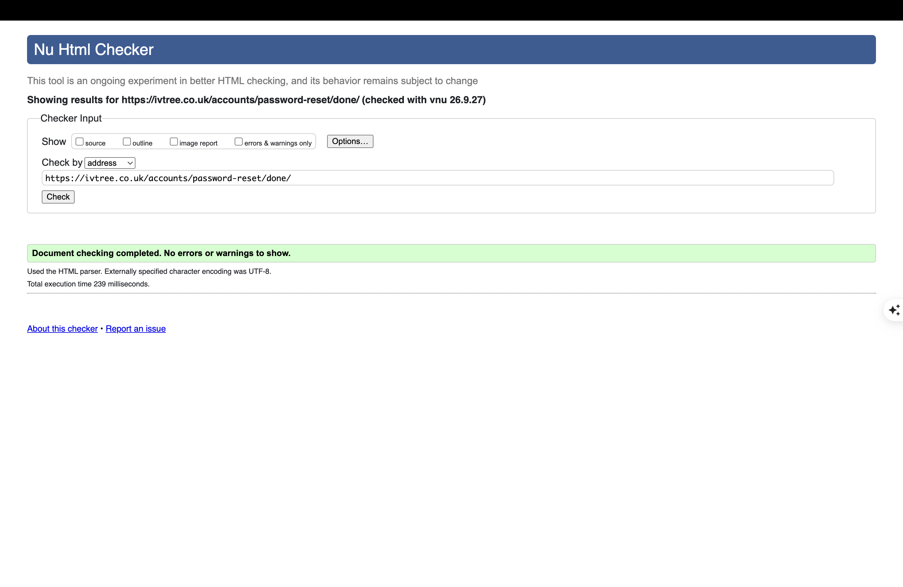

### Support

Result: **PASS**


### Tree Detail

Result: **PASS**

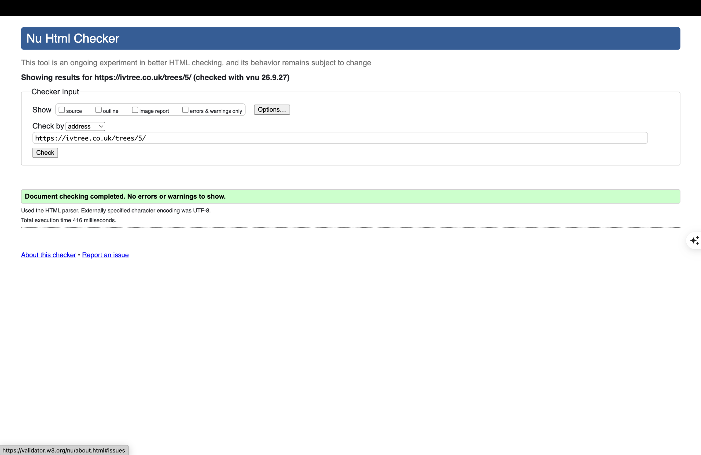

### 404

Result: **PASS**

The validator's error-page option was enabled so that the HTML contained in the intentional HTTP 404 response could be checked.

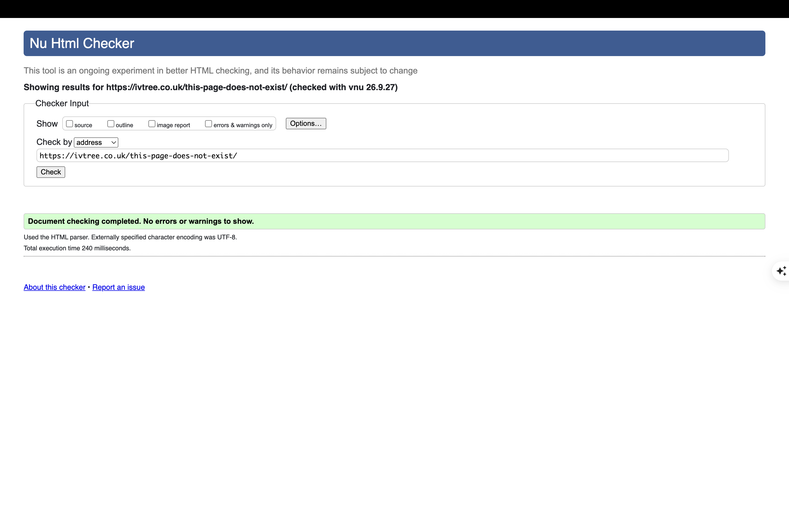

---

## CSS

CSS was checked using the W3C CSS Validation Service.

Result:

```text
Congratulations! No Error Found.
```

Evidence:

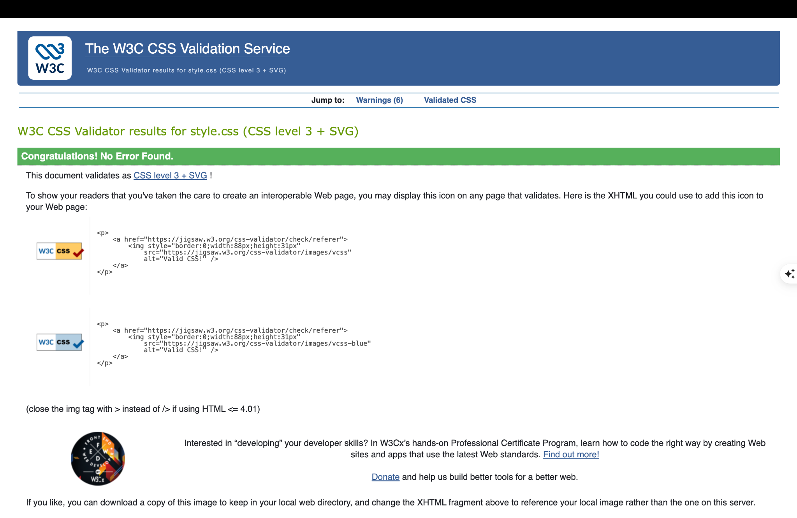

Six warnings were reported for WebKit-specific scrollbar selectors.

These are intentional vendor-specific enhancements:

```css
::-webkit-scrollbar
::-webkit-scrollbar-track
::-webkit-scrollbar-thumb
```

They do not represent CSS errors.

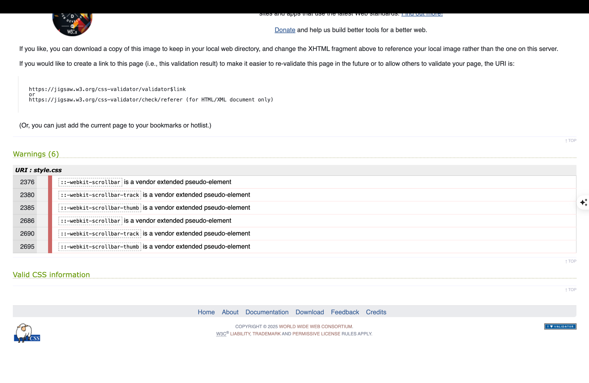

---

## JavaScript

Authored JavaScript was checked using JSHint 2.13.6.

### Base

Result: **PASS**

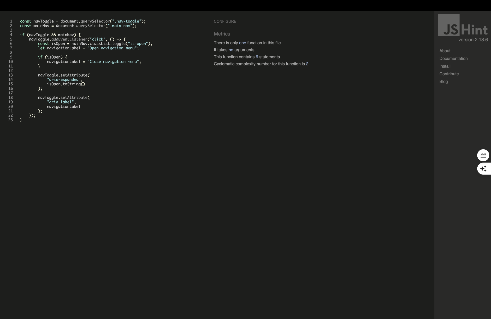

### Homepage Map

Result: **PASS**

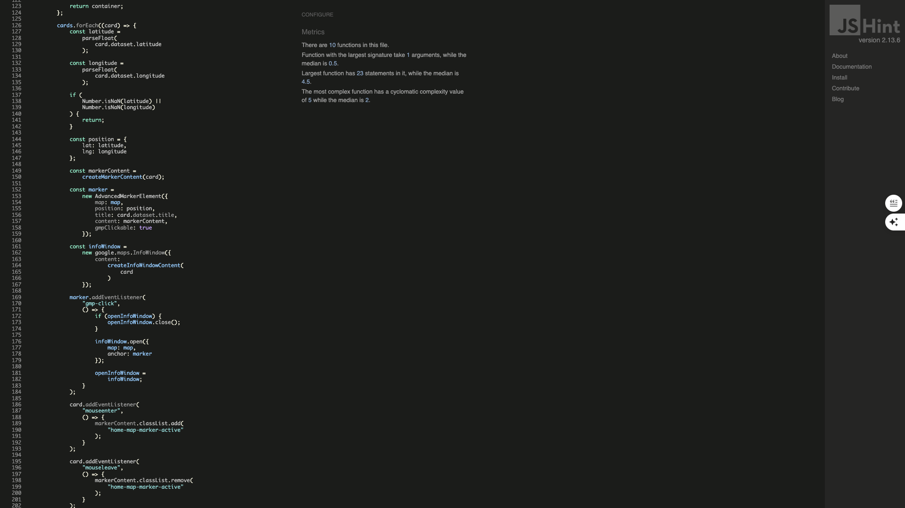

### Report Detail

Result: **PASS**

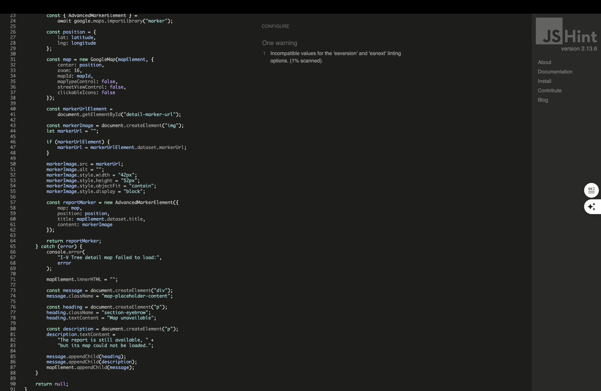

### Report Form

Result: **PASS**

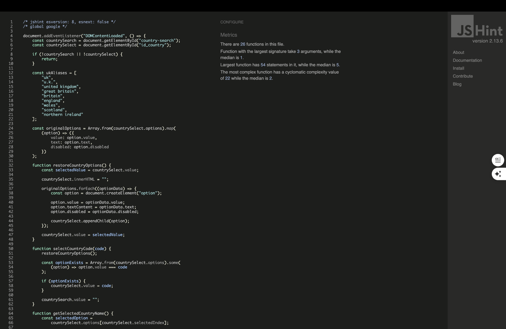

### Report Map

Result: **PASS**

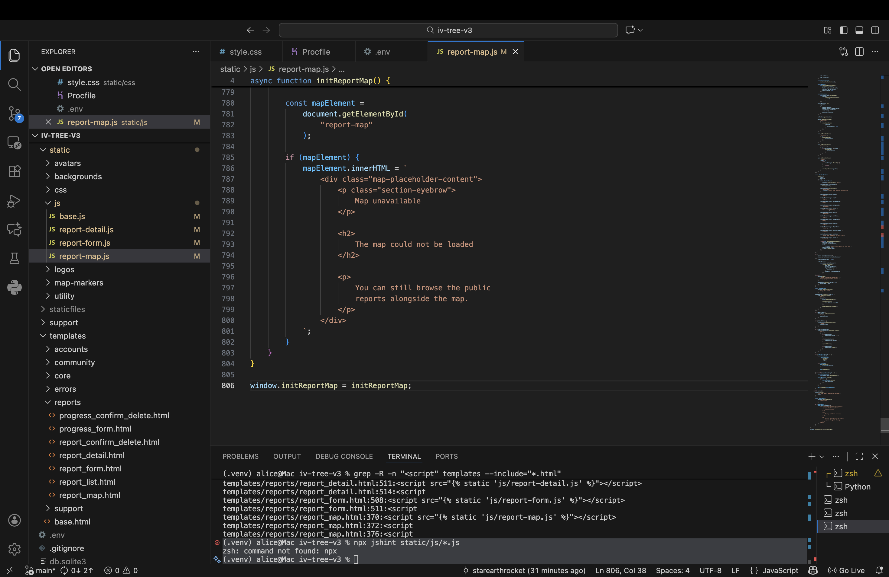

---

# Browser Console Testing

Chrome Developer Tools was checked while visiting key pages including:

- Homepage;
- Explore Map;
- Report a Tree;
- Dashboard;
- Community;
- Support.

No errors originating from I-V Tree, Django or the authored JavaScript were identified.

Some browser-extension warnings were visible from software such as Grammarly and third-party content scripts.

These messages were not generated by I-V Tree.

---

# Bugs and Fixes

## Staticfiles Manifest After JavaScript Refactor

### Problem

Moving inline JavaScript into standalone static files caused the existing staticfiles manifest to reference an older set of assets.

### Fix

Static files were regenerated with:

```bash
python manage.py collectstatic --noinput
```

The automated suite then passed.

---

## Explore Map ARIA Validation

### Problem

The validator identified an `aria-label` on the map container without an appropriate role.

### Fix

The map container received:

```html
role="region"
```

Result: **PASS**

---

## Tree Detail Map ARIA Validation

### Problem

The tree-detail map produced the same validation issue.

### Fix

The container received:

```html
role="region"
```

Result: **PASS**

---

## Registration Password Help HTML

### Problem

Django's password help contains an unordered list.

It was initially rendered inside a `<small>` element, creating invalid markup.

### Fix

Help text was placed inside:

```html
<div class="form-help-text">
```

Result: **PASS**

---

## Community Post Heading Validation

### Problem

The W3C validator reported heading-structure warnings caused by unnecessary nested sectioning elements.

### Fix

Unnecessary `section`/`article` wrappers were replaced with neutral `div` containers while preserving the page heading.

Result: **PASS**

---

## Mobile Authentication Fields

### Problem

Email/password inputs used browser-default widths because the shared form CSS only targeted text/search inputs.

### Fix

Shared styling was extended to include:

```css
input[type="email"]
input[type="password"]
```

Mobile authentication buttons were also made full-width.

Result: **PASS**

---

## Google Maps on the Custom Domain

### Problem

Maps stopped loading after the production custom domain was introduced.

### Cause

The Google Maps API key referrer restrictions did not yet include the new domain.

### Fix

The following were added:

```text
https://ivtree.co.uk/*
https://www.ivtree.co.uk/*
```

Result: production maps restored.

---

## Heroku Not Serving Latest GitHub Code

### Problem

New commits existed on GitHub but production continued serving an older Heroku release.

### Cause

Automatic deployments were not enabled.

### Fix

The current `main` branch was deployed manually through Heroku.

Production output was verified using `curl`.

---

## Production Sender Domain

### Problem

The transactional sender initially referenced an earlier hyphenated domain.

### Fix

The sender was corrected to:

```text
noreply@ivtree.co.uk
```

The complete production password-reset flow was then tested successfully.

---

# Security

Security measures include:

- Django secret key stored in environment variables;
- `.env` ignored by Git;
- database credentials kept outside source control;
- Stripe secret key stored outside source control;
- Stripe webhook secret stored outside source control;
- Google Maps credential configured externally;
- what3words credential configured externally;
- Cloudinary credentials configured externally;
- SMTP password configured externally;
- `DEBUG` disabled in production;
- configured `ALLOWED_HOSTS`;
- configured `CSRF_TRUSTED_ORIGINS`;
- HTTPS redirect in production;
- secure production cookies;
- HSTS enabled;
- proxy SSL header configuration;
- Stripe webhook signature verification;
- user ownership checks;
- staff-only Django admin access.

No production secret values are intentionally stored in the Git repository.

---

# Deployment

I-V Tree is deployed to Heroku.

Production site:

[https://ivtree.co.uk/](https://ivtree.co.uk/)

## Production Components

The production system uses:

- Heroku hosting;
- Gunicorn;
- Heroku Postgres;
- WhiteNoise/static-file configuration;
- Cloudinary configuration;
- Purelymail SMTP;
- Google Maps;
- what3words;
- Stripe;
- custom domain.

## Procfile

```text
release: python manage.py migrate
web: gunicorn config.wsgi
```

The release process applies database migrations.

The web process starts Django using Gunicorn.

---

## Database

Production uses Heroku Postgres.

Django database configuration is centralised using:

```python
dj_database_url
```

This allows the database connection to change between environments without hard-coded production credentials.

---

## Static Files

Authored static files live in:

```text
static/
```

Collected production assets are generated into:

```text
staticfiles/
```

`staticfiles/` is generated output and should not be manually edited.

Collection command:

```bash
python manage.py collectstatic --noinput
```

---

## Custom Domain

Production domain:

```text
ivtree.co.uk
```

Also configured:

```text
www.ivtree.co.uk
```

DNS is managed through Porkbun and points to Heroku DNS targets.

HTTPS is provided through Heroku certificate management.

---

## Production Email

SMTP configuration is supplied through environment variables.

The transactional sender is:

```text
noreply@ivtree.co.uk
```

The production password-reset process was tested from request through to successful login with the replacement password.

---

## Google Maps

Production HTTP referrers include:

```text
https://ivtree.co.uk/*
https://www.ivtree.co.uk/*
```

---

## Stripe

Required Stripe settings include:

- public key;
- secret key;
- webhook secret;
- currency.

Credentials are stored in Heroku configuration rather than source control.

---

## Deployment Procedure

1. Commit changes locally.

```bash
git add .
git commit -m "Descriptive commit message"
```

2. Push to GitHub.

```bash
git push
```

3. Open the Heroku application.

4. Open **Deploy**.

5. Confirm the connected repository:

```text
starearthrocket/iv-tree-v3
```

6. Confirm the branch:

```text
main
```

7. Under Manual Deploy select:

```text
Deploy Branch
```

8. Wait for the build and release phases to finish.

9. Verify the live site:

```text
https://ivtree.co.uk/
```

10. Perform a production regression check.

---

# Local Development

## Clone

```bash
git clone https://github.com/starearthrocket/iv-tree-v3.git
cd iv-tree-v3
```

## Create Virtual Environment

```bash
python -m venv .venv
source .venv/bin/activate
```

## Install Dependencies

```bash
pip install -r requirements.txt
```

## Environment File

Create:

```text
.env
```

This file must not be committed.

## Migrations

```bash
python manage.py migrate
```

## Static Files

```bash
python manage.py collectstatic --noinput
```

## Development Server

```bash
python manage.py runserver
```

Visit:

```text
http://127.0.0.1:8000/
```

## Tests

```bash
python manage.py test
```

## Django Checks

```bash
python manage.py check
```

---

# Environment Variables

The application uses environment-based configuration.

| Variable | Purpose |
|---|---|
| `DJANGO_SECRET_KEY` | Django secret |
| `DEBUG` | Debug mode |
| `ALLOWED_HOSTS` | Valid hosts |
| `CSRF_TRUSTED_ORIGINS` | HTTPS trusted origins |
| `DATABASE_URL` | PostgreSQL connection |
| `CLOUDINARY_CLOUD_NAME` | Cloudinary account |
| `CLOUDINARY_API_KEY` | Cloudinary API key |
| `CLOUDINARY_API_SECRET` | Cloudinary secret |
| `EMAIL_HOST` | SMTP server |
| `EMAIL_PORT` | SMTP port |
| `EMAIL_HOST_USER` | SMTP username |
| `EMAIL_HOST_PASSWORD` | SMTP password |
| `EMAIL_USE_TLS` | SMTP TLS |
| `DEFAULT_FROM_EMAIL` | Sender identity |
| `GOOGLE_MAPS_API_KEY` | Google Maps API |
| `GOOGLE_MAPS_MAP_ID` | Map ID |
| `WHAT3WORDS_API_KEY` | what3words API |
| `STRIPE_PUBLIC_KEY` | Stripe publishable key |
| `STRIPE_SECRET_KEY` | Stripe secret |
| `STRIPE_WEBHOOK_SECRET` | Stripe webhook verification |
| `STRIPE_CURRENCY` | Payment currency |

Secret values must never be committed.

---

# Known Limitations

## Direct User Support

The assessed version sends transactional email from:

```text
noreply@ivtree.co.uk
```

There is currently no dedicated Contact/Help page or monitored support address in the assessed Project 4 scope.

This has been identified as a UX limitation.

A direct support route is planned immediately after assessment submission.

---

## Public Launch Legal/Compliance Material

The assessed application focuses on the technical full-stack requirements.

Before wider public promotion, a separate launch-readiness review is planned covering:

- Privacy Policy;
- Terms of Use;
- cookie/consent requirements;
- Community Rules;
- tree/safety wording;
- user-support route;
- moderation/reporting processes;
- applicable online-safety requirements.

---

## Legacy Location Field

`location_name` remains for compatibility with earlier report records.

Structured location data is preferred for new reports.

---

## Manual Deployment

Automatic GitHub-to-Heroku deployment is not currently enabled.

The developer must manually deploy `main` through Heroku after pushing new production changes.

---

# Future Development

## Contact and Help

Planned after assessment submission:

- Contact/Help page;
- monitored support email such as `support@ivtree.co.uk`;
- account support;
- report support;
- payment/support guidance.

## Legal and Compliance

Before active public promotion:

- Privacy Policy;
- Terms of Use;
- cookie review;
- Community Rules;
- moderation/reporting process;
- safety wording;
- relevant online-safety review.

## Responsible Authority Escalation

Future development may allow a saved report to be escalated to an appropriate responsible body.

Examples include:

- local councils;
- landowners;
- electricity network operators.

For reports involving electricity infrastructure, the application would provide prominent safety guidance and an escalation route rather than encouraging users to cut or touch vegetation near electrical equipment.

## Mobile Applications

The longer-term architecture is intended to allow the same Django backend and canonical tree database to serve future Android/iOS applications.

## Organisational Dashboards

Future versions may provide specialised dashboards for organisations such as:

- councils;
- conservation organisations;
- other land-management or responsible bodies.

---

# Version Control

Git and GitHub were used throughout development.

Repository:

[https://github.com/starearthrocket/iv-tree-v3](https://github.com/starearthrocket/iv-tree-v3)

Development was committed incrementally with descriptive messages.

Recent examples include:

```text
c8dd219 Add homepage map JavaScript validation evidence
88cd05f Improve mobile authentication form styling
7167fe6 Add HTML and CSS validation evidence
3e99bb6 Fix community post heading validation
a22e4d2 Fix tree detail map accessibility validation
1ac7eb7 Fix registration help text validation
9131d41 Fix map accessibility validation
f9de4ea Replace homepage prototype map with live reports
7293f08 Fix production email sender domain
7d32c53 Clean repository and remove unused asset
7542b65 Audit code structure and strengthen validation
64d8644 Validate and clean JavaScript
da60b2f Refactor report map JavaScript
e66724b Refactor report form JavaScript
7db1a95 Move report detail map JavaScript to static file
a8c8c37 Move navigation JavaScript to static file
```

This provides a record of both feature development and subsequent refinement/testing.

---

# Credits

## Frameworks and Libraries

- [Django](https://www.djangoproject.com/)
- [Google Maps Platform](https://developers.google.com/maps)
- [Google Maps MarkerClusterer](https://github.com/googlemaps/js-markerclusterer)
- [Stripe](https://stripe.com/)
- [Cloudinary](https://cloudinary.com/)
- [django-countries](https://github.com/SmileyChris/django-countries)
- [WhiteNoise](https://whitenoise.readthedocs.io/)
- [dj-database-url](https://github.com/jazzband/dj-database-url)
- [Pillow](https://python-pillow.org/)
- [Gunicorn](https://gunicorn.org/)

## Hosting and Services

- [Heroku](https://www.heroku.com/)
- Heroku Postgres
- [Porkbun](https://porkbun.com/)
- [Purelymail](https://purelymail.com/)
- [what3words](https://what3words.com/)

## Validation Tools

- [W3C Nu HTML Checker](https://validator.w3.org/nu/)
- [W3C CSS Validation Service](https://jigsaw.w3.org/css-validator/)
- [JSHint](https://jshint.com/)

---

# Final Assessment Preparation Status

At the final Project 4 assessment-preparation stage:

- Django full-stack application: PASS
- relational database: PASS
- multiple Django apps: PASS
- custom models: PASS
- CRUD: PASS
- authentication: PASS
- permissions: PASS
- custom production domain: PASS
- production PostgreSQL: PASS
- Google Maps: PASS
- what3words integration: PASS
- Stripe donation workflow: PASS
- production password-reset email: PASS
- responsive testing: PASS
- keyboard/accessibility checks: PASS
- HTML validation: PASS
- CSS validation: PASS with documented vendor warnings
- JavaScript validation: PASS
- automated tests: **58 PASS**
- production regression testing: PASS
- secrets excluded from Git: PASS
- production `DEBUG` disabled: PASS

I-V Tree is a deployed full-stack Django application combining relational data, authentication, permissions, mapping, user-generated content, payments, production email and documented testing.